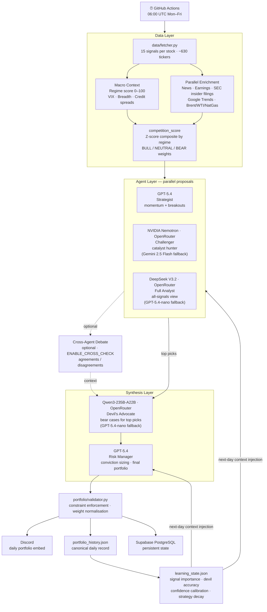
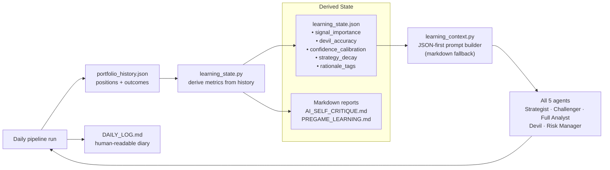

# AlphaShark


An autonomous quantitative trading agent for the **Äripäev/SEB Investment Game** (Estonia). It runs daily via GitHub Actions, fetches live market data across ~630 selectable tickers in 6 markets, scores the full universe, runs a multi-model adversarial AI ensemble, validates the final portfolio against competition rules, and posts the recommendation to Discord.

**Game period: 6 April – 19 June 2026 · 844 participants · objective: rank #1**

---

## Engineering Highlights

These are the non-obvious design decisions worth explaining in depth.

**Adversarial multi-agent ensemble**
Three agents propose portfolios in parallel — Strategist, Challenger, and Full Analyst — using configurable model routes and fallbacks. A separate Devil pass stress-tests the combined shortlist, then the Risk Manager synthesizes the final portfolio. Agent roles are stable; model routing is intentionally configurable via `config.py`.

**Self-improving learning loop**
Every run persists to `portfolio_history.json`. `learning_state.py` derives structured metrics from that history: per-signal directional accuracy, devil accuracy vs actual returns, confidence calibration, and strategy decay. These are injected as structured JSON into the next day's prompts — the system learns from its own track record without any human labelling.

**Optional cross-agent debate (second pass)**
The debate pass is available behind `ENABLE_CROSS_CHECK` for shadow comparison experiments. When enabled, agents surface agreements/disagreements for Risk Manager context; when disabled (default), the pipeline skips this latency/cost step.

**Competition-optimized quantitative ranking**
Candidates are ranked by `competition_score`, a regime-specific Z-score composite: in BULL regimes it weights `mom_20d` 35%, `mom_5d` 25%, `sharpe_20d` 20%, `beta` 20% — different weights in NEUTRAL and BEAR. The regime is determined by a 0–100 composite score from VIX level, VIX term structure, SPX vs 200d SMA, market breadth, and credit spreads.

**SHA256 strategy lock in LIVE mode**
Once the competition starts, `live_mode_lock.json` stores SHA256 fingerprints of all strategy files. Any accidental drift (edited prompt, changed config) is caught at startup and the pipeline refuses to run. This prevents the classic mistake of iterating on a live competition system mid-game.

**Symbol aliasing across 6 markets**
Nordic and Baltic tickers differ between the game UI, Yahoo Finance, and EODHD (fallback provider). `symbol_master.json` maintains the canonical mapping. Yahoo is the primary source; EODHD is used only for a curated override set of edge-case tickers where Yahoo's coverage is unreliable.

---

## Tech Stack

| Layer | Technology | Why |
|-------|-----------|-----|
| Language | Python 3.11+ | Type hints, dataclasses, async-compatible |
| AI — Strategist + Risk Manager | OpenAI GPT-5.4 | Strongest instruction-following for structured JSON portfolio output |
| AI — Challenger (primary) | OpenRouter NVIDIA Nemotron-Super-120B (free) | Free high-quality model; independent model family reduces correlated errors |
| AI — Challenger fallback 1 | Google Gemini 2.5 Flash | Kicks in when OpenRouter/Nemotron is unavailable |
| AI — Challenger fallback 2 | OpenAI GPT-5.4-nano | Final safety net when both OpenRouter and Gemini fail |
| AI — Full Analyst | OpenRouter DeepSeek V3.2 | Strong all-signal reasoning at low token cost; GPT-5.4-nano fallback if needed |
| AI — Devil | OpenRouter Qwen3-235B-A22B | Strongest adversarial critique model; GPT-5.4-nano fallback if needed |
| Market data | yfinance (primary), EODHD (fallback) | Free + reliable for S&P 500; EODHD fills Nordic/Baltic tickers where yfinance coverage is unreliable |
| Enrichment | pytrends, SEC EDGAR Form 4 API, yfinance news | Catalyst signals not in price data |
| Automation | GitHub Actions | Zero-infra scheduled runs; secrets management; auto-commit results |
| Notifications | Discord webhooks | Formatted daily embeds; @mention reminders in LIVE mode |
| Persistence | Supabase PostgreSQL + derived JSON/Markdown artifacts | Canonical DB state with local artifacts for auditability and reports |

---

## Key Features

- **Mixed AI decision stack**: Strategist + Challenger + Full Analyst run in parallel, Devil pressure-tests the shortlist, and Risk Manager synthesizes the final portfolio. Routes/fallbacks are configurable in `config.py`.
- **Full-universe candidate set**: agents see the current filtered universe instead of a tiny shortlist capped per market
- **Rich signal snapshot**: momentum, Sharpe, RSI, beta, volume confirmation, MACD, ATR, dividend yield, regime data, and catalyst overlays
- **Parallel enrichment layer**: news, earnings, insider buying, and Google Trends are fetched concurrently and injected into prompts
- **Sector rotation indicator**: per-sector `avg_mom_20d/5d`, RSI, breadth, and count computed from the full universe and injected into all agent prompts — rotation is the primary alpha source in 75-day competitions
- **Pre-earnings opportunity signal**: tags stocks with earnings in 2–6 days + strong momentum as `PRE_EARNINGS_SETUP`; `EARNINGS RISK` warnings for low-conviction earners
- **Competition-optimized ranking**: regime-specific Z-score weighted `competition_score` (BULL: mom_20d 35% + mom_5d 25% + sharpe_20d 20% + beta 20%; NEUTRAL/BEAR variants) replaces the generic selection score
- **Commodity price context**: live Brent crude, WTI, and Henry Hub nat gas injected for energy thesis validation
- **Optional cross-agent debate**: second-pass agreement/disagreement analysis is available behind `ENABLE_CROSS_CHECK` for shadow comparisons
- **Dynamic signal importance**: `learning_state.py` tracks directional accuracy of each signal vs next-day returns; most predictive signals flagged in the learning context
- **Strategy decay monitoring**: compares recent 5-day alpha vs prior 10-day alpha; Risk Manager sees a STRATEGY DECAY ALERT when momentum gap exceeds threshold
- **Confidence calibration tracking**: flags overconfidence patterns when high-confidence days underperform expectations
- **Structured learning loop**: `portfolio_history.json` stores the canonical daily record, `learning_state.json` drives prompt injection, and `PREGAME_LEARNING.md` / `AI_SELF_CRITIQUE.md` are derived human summaries
- **Verification and audit trail**: whole-percent portfolio rounding, manual verification tooling, and devil's-advocate impact logging
- **Historical shadow trader**: strict no-lookahead backtest script for open-to-open portfolio simulation over prior periods

**Quick commands:**
```bash
python main.py                   # Run full pipeline
python scripts/status.py         # View project dashboard (costs, learning, next steps)
python scripts/verify.py         # Confirm portfolio sync (LIVE mode)
python scripts/check_models.py   # Smoke-test model routes/keys without full pipeline run
python scripts/pregame_review.py # View learning summary (PREGAME mode)
python scripts/historical_shadow_trader.py --start 2024-04-01 --end 2024-06-21
```

---

## Daily workflow

```
08:00 CEST (Paris) / 09:00 EEST (Tallinn) during the game period — GitHub Actions fires at 06:00 UTC:
  python main.py
      ↓ fetches market data + signals
      ↓ enriches with news, earnings, insider, and trends context
      ↓ runs strategist + challenger in parallel
      ↓ runs devil's advocate against the top combined picks
      ↓ synthesises, validates, and rounds the final portfolio
      ↓ posts Discord embed with proposed portfolio
      ↓ updates paper account and learning files

You check Discord and manually update your game portfolio before:
  09:00 CEST / 10:00 EEST during summer time
  08:00 CET / 09:00 EET before the DST switch
  practical rule: submit before the game's 10:00 local cutoff

Then confirm the system's record matches yours:
  python scripts/verify.py

`verify.py` is the truth-after-submission step: it confirms or corrects the day's canonical record and marks it as verified.
```

### Current mode: LIVE (since 6 April 2026)

The bot is now in **LIVE mode** — every decision counts toward the real game ranking.

- Writes to `DAILY_LOG.md` (one entry per trading day)
- Strategy files are SHA256-locked via `live_mode_lock.json` — any accidental change is caught at startup
- `verify.py` must be run after each manual submission to keep the system's record in sync
- A second GitHub Actions workflow fires at 07:00 UTC and pings Discord if verification hasn't happened

**Pre-game training ran from ~March through 5 April.** During that period the system operated in PREGAME mode: recording decisions to `PREGAME_LOG.md`, tracking a virtual €10k paper account, and building up `learning_state.json` from 30 days of paper trades. That structured history is still injected into every live-mode prompt — the pre-game learning carries forward.

---

## Live Performance

**Game start:** 6 April 2026 · **Today:** 24 April 2026 · **Days elapsed:** ~14 trading days

| Metric | Value |
|--------|-------|
| Pre-game paper return (30 days) | **+13.96%** |
| Pre-game win/loss record | 16W – 14L |
| Devil's advocate accuracy | 24.14% (surprisingly bullish — signals are mostly noise) |
| Best pre-game signal | `vol_ratio` — breakout confirmation (≈62% directional accuracy) |
| Worst pre-game signal | `catalyst` rationale tag (–43% alpha vs benchmark) |

**What's working:**
- Momentum + volume confirmation (`mom_20d` + `vol_ratio`) — the core alpha source
- Pre-earnings setups with RSI 50–75 — consistent edge when sized correctly (≤20%)
- Aggressive concentration (5 names at ~20% each) — outperforms diversified books in 75-day format

**What isn't working:**
- Nordic diversification for its own sake — adding EQNR.OL, DOW, VWS.CO as "balance" diluted returns
- Over-cautious tuning in early pregame — conservative risk limits hurt performance before they were relaxed
- `non_US_differentiator` rationale tag — –27% alpha; Nordic names need genuine signal, not geographic quota

**Key lesson:** The game rewards conviction. Equal-weighting or sector-capping to look balanced is the fastest way to lose to a competitor running 5 concentrated positions.

---

## How it works



### The learning loop



---

## Current portfolio construction strategy

- **High-conviction concentration**: the system aims to stay concentrated, usually around 5-8 names depending on regime, risk-manager synthesis, and validator normalization
- **Unequal sizing by conviction**: the prompts explicitly push top-heavy sizing instead of equal weight, typically with a 25/25/25/20/5 shape in stronger regimes
- **Consensus first, catalysts second**: the Risk Manager prefers names selected by both Strategist and Challenger, then fills remaining slots with the best unique catalyst picks
- **Devil's-advocate check**: top combined picks are pressure-tested before final sizing so obvious dead-money or asymmetric-risk names can be cut or downweighted
  - **Devil accuracy feedback loop**: when Devil's accuracy at flagging true underperformers exceeds 60%, the Risk Manager applies a 10% hard cap on HIGH-flagged positions (tracked in `learning_state.json`)
  - **Devil repeat-offender pre-injection**: tickers flagged HIGH in ≥2 of the last 5 days get a ≤12% sizing warning shown to all agents regardless of overall accuracy threshold
- **Overbought weight cap**: positions with RSI > 79 AND within 2% of 52w high are capped at 15% unless vol_ratio > 1.8 (exception for confirmed volume breakouts). Threshold was lowered from 82 → 79 to catch RSI 79–82 exhaustion earlier.
- **No sector cap**: sector concentration is intentionally allowed if one theme has the strongest momentum
- **Cross-market awareness**: the agents are steered away from cloning a pure US mega-cap portfolio and are encouraged to use Nordic/Baltic names when signal quality justifies it
- **High RSI is not an auto-reject**: strong RSI plus volume confirmation is treated as a breakout clue, not a blanket overbought filter (but see overbought weight cap rule above)

---

## Signals computed per candidate

Directional accuracy is tracked live in `learning_state.json` — how often each signal's direction matched next-day returns. Updated automatically each run.

| Signal | What it means | Global acc. | BULL | NEUTRAL |
|--------|---------------|:-----------:|:----:|:-------:|
| `momentum` | 20-day price return — primary momentum signal | 55% | 81% | 48% |
| `sharpe_20d` | momentum / annualised vol — primary ranking signal | 55% | 81% | 48% |
| `mom_5d` | 5-day return (short-term acceleration) | 55% | 81% | 48% |
| `mom_60d` | 60-day return (longer trend confirmation) | — | — | — |
| `vol_ratio` | today's volume / 20d avg volume — breakout confirmation (>1.5 = strong) | **62%** | 81% | **54%** |
| `vs_index` | stock return minus S&P 500 return — pure alpha signal | 55% | 81% | 48% |
| `rsi_14` | 14-day RSI — breakout/exhaustion context, not a hard filter | 54% | 78% | 48% |
| `beta` | sensitivity to S&P 500 moves | 53% | 81% | 49% |
| `pct_from_52w_high` | proximity to 52-week high — breakout signal | — | — | — |
| `macd_hist` | MACD histogram normalised by price — trend acceleration | — | — | — |
| `atr_pct` | 14-day ATR as % of price — daily expected move, used for sizing | — | — | — |
| `dividend_yield` | trailing 12-month yield — game auto-reinvests dividends | — | — | — |
| `analyst_rating` | consensus rating 1–5 (1=Strong Buy); good US coverage, partial Nordic | — | — | — |
| `analyst_upside` | (target − price) / price; NaN for non-US tickers (currency mismatch) | — | — | — |
| `sector` | sector tag (Tech, Health, Fin, Energy, Ind, Mat, Tel, Util, Cons) | — | — | — |

`vol_ratio` is consistently the highest-accuracy individual signal. In BULL regimes almost all momentum signals converge — the edge comes from conviction sizing, not signal selection.

---

## Extra context injected into prompts

| Signal | Source | What it tells the AI |
|--------|--------|----------------------|
| SPX vs 200d SMA | yfinance | Broad market trend |
| VIX level | yfinance `^VIX` | Current fear level |
| VIX term structure | yfinance `^VIX3M / ^VIX` | >1 = calm, <0.9 = fear spike |
| Market breadth | computed from universe | % of stocks above 50d SMA |
| Credit spread change | yfinance `HYG / LQD` 20d | Risk-on/off signal ahead of VIX |
| **Composite regime score** | all 4 signals above | **0–100: 0–30 defensive, 31–49 cautious, 50–69 neutral, 70+ bullish** |
| Earnings warnings | yfinance calendar | Flags stocks reporting within 7 days |
| News headlines | yfinance news | Recent headlines for top candidate stocks |
| Insider buying | SEC EDGAR Form 4 | Recent open-market insider purchases over $50k for US tickers |
| Search interest | Google Trends via `pytrends` | Flags crowded retail trades vs under-the-radar names |
| Short interest | yfinance | Challenger-only catalyst signal for squeeze setups |
| Premarket gap | yfinance intraday/daily data | Challenger-only catalyst confirmation |
| IV proxy | yfinance options / info | Challenger-only event-volatility signal |
| Sector rotation table | computed from full universe | Per-sector avg_mom_20d/5d, RSI, breadth, count — all agents |
| Pre-earnings setup | earnings_fetcher.py | `PRE_EARNINGS_SETUP` tag for 2–6 day earners with strong momentum; `EARNINGS RISK` for low-conviction |
| Commodity context | yfinance BZ=F / CL=F / NG=F | Brent, WTI, nat gas last price + 20d/5d return for energy thesis |
| Signal importance | learning_state.json | Per-signal directional accuracy vs next-day returns |
| Cross-agent debate | orchestrator debate step | Agreements/disagreements between Strategist and Challenger proposals |
| Strategy decay alert | meta_learning.py | Flags when recent 5d alpha lags prior 10d alpha by >0.2%/day |
| Learning state | learning_state.json | Structured rules, winners/losers, decision-quality metrics |
| Learning report | PREGAME_LEARNING.md | Human-readable training summary |
| AI self-critique | AI_SELF_CRITIQUE.md | Human-readable reasoning audit |

---

## Game constraints

| Rule | Value |
|------|-------|
| Min stocks | 5 |
| Max stocks | 20 |
| Min position weight | 5% |
| Max position weight | 25% |
| Max total weight | 100% |
| Min total weight | 75% (max 25% cash — cash earns no return) |

---

## Universe

Stocks across 6 markets: **US S&P 500**, **OMX Helsinki Large Cap** (Finland), **OMX Stockholm 30** (Sweden), **OBX** (Norway), **OMX Copenhagen 25** (Denmark), **Baltic Main List** (Tallinn, Riga, Vilnius), minus any tickers explicitly excluded because they are not selectable in the game UI.

Candidate selection currently works like this:
- Start from the current game-sized universe, roughly 630 selectable names
- Use Yahoo as the primary price source, with EODHD fallback for a small provider-override set of Nordic/Baltic edge cases
- Maintain a symbol master / alias layer so game tickers, Yahoo symbols, and fallback-provider symbols can differ safely
- Rank candidates with a regime-specific `competition_score` (Z-score weighted: BULL = mom_20d 35% + mom_5d 25% + sharpe_20d 20% + beta 20%; NEUTRAL/BEAR variants) plus catalyst overlays
- Top `TOP_N_CANDIDATES` are passed downstream after filtering and scoring

---

## Data Sources & APIs

| Source | What it provides | Required key |
|--------|-----------------|:------------:|
| **yfinance** | Primary price data, OHLCV history, fundamentals, analyst ratings, earnings calendar, news headlines, options data, insider filing summaries | None (free) |
| **EODHD** | Fallback for Nordic/Baltic tickers where yfinance coverage is unreliable or missing | `EODHD_API_KEY` |
| **OpenAI** | GPT-5.4 for Strategist + Risk Manager; GPT-5.4-nano as last-resort fallback for all agents | `OPENAI_API_KEY` |
| **OpenRouter** | Routes NVIDIA Nemotron-Super-120B (Challenger), DeepSeek V3.2 (Full Analyst), Qwen3-235B-A22B (Devil) | `OPENROUTER_API_KEY` |
| **Google Gemini** | Gemini 2.5 Flash — Challenger fallback when OpenRouter/Nemotron is unavailable | `GEMINI_API_KEY` |
| **SEC EDGAR Form 4** | Recent open-market insider purchases >$50k for US S&P 500 tickers | None (public API) |
| **Google Trends** (`pytrends`) | Search interest — distinguishes crowded retail names from under-the-radar setups | None (free) |
| **Discord webhooks** | Daily portfolio embed; @mention reminders in LIVE mode | `DISCORD_WEBHOOK_URL` |
| **Supabase PostgreSQL** | Canonical persistent state (portfolios, learning records, cost log) | `SUPABASE_URL` + `SUPABASE_KEY` |
| **Norkon/Äripäev game API** | Live rank, portfolio value, and daily returns scraped from the game platform via JWT auth + Playwright | `ARIPAEV_COOKIE` |
| **GitHub Actions** | Zero-infra scheduled runs; auto-commits portfolio + learning files back to repo | Repo secrets |

**Norkon integration note:** The game UI is a React SPA backed by the Norkon trading platform. Portfolio stats (rank, value, returns) are delivered via WebSocket frames — `verify.py` uses Playwright to intercept those WS frames and extract the data, with a REST fallback for less-frequent polling.

---

## Setup

```bash
cp .env.example .env   # fill in your API keys
pip install -r requirements.txt
python main.py
```

### GitHub Actions (automated daily runs)

1. Push the repo to GitHub
2. Go to **Settings → Secrets and variables → Actions**
3. Add these repository secrets:
   - `OPENAI_API_KEY` (required — Strategist + Risk Manager + all nano fallbacks)
   - `GEMINI_API_KEY` (required — Gemini 2.5 Flash, challenger second fallback)
   - `OPENROUTER_API_KEY` (required — NVIDIA Nemotron challenger, DeepSeek Full Analyst, Qwen3 Devil)
   - `EODHD_API_KEY` (required — Nordic/Baltic ticker fallback)
   - `DISCORD_WEBHOOK_URL` (required)
   - `DISCORD_USER_ID` (optional — enables @mentions in LIVE mode)
4. The main workflow fires at **06:00 UTC** on weekdays:
   - During the game's summer-time window: **08:00 CEST** (Paris) / **09:00 EEST** (Tallinn)
   - This is designed to leave roughly one hour before the 10:00 local submission cutoff
5. After each run, portfolio and learning files are committed back to the repo automatically
6. **In LIVE mode**: a second workflow fires at 07:00 UTC (09:00 CEST / 10:00 EEST) and sends a Discord reminder if `verify.py` hasn't been run

### Required environment variables

```
OPENAI_API_KEY=...         # GPT-5.4 Strategist + Risk Manager + GPT-5.4-nano fallbacks
GEMINI_API_KEY=...         # Gemini 2.5 Flash — Challenger second fallback
OPENROUTER_API_KEY=...     # NVIDIA Nemotron (Challenger primary) + DeepSeek V3.2 (Full Analyst) + Qwen3-235B-A22B (Devil)
EODHD_API_KEY=...          # EODHD fallback for Nordic/Baltic tickers yfinance can't fetch
DISCORD_WEBHOOK_URL=...    # Discord channel webhook for daily posts
DISCORD_USER_ID=...        # optional: Discord user ID for @mentions in LIVE mode
```

---

## Project structure

```
├── main.py                      # entry point
├── orchestrator.py              # full pipeline wiring
├── config.py                    # universe, signal params, game constraints, sector map
├── scripts/
│   ├── status.py                # project dashboard (costs, learning, next steps)
│   ├── verify.py                # interactive CLI to confirm/correct daily portfolio
│   ├── pregame_review.py        # refresh/print pre-game learning summary
│   ├── evening_review.py        # end-of-day Discord performance review
│   ├── historical_shadow_trader.py # no-lookahead historical simulator / backtest
│   └── verification_reminder.py # GitHub Actions job for LIVE mode sync reminders
├── docs/
│   └── rules.txt                # official game rules reference
├── data/
│   ├── fetcher.py               # market data, regime data, catalyst signals, candidate ranking
│   ├── earnings_fetcher.py      # upcoming earnings calendar (7-day risk warnings)
│   ├── news_fetcher.py          # recent headlines for top candidates (yfinance)
│   ├── insider_fetcher.py       # SEC EDGAR insider-buying enrichment for US stocks
│   ├── trends_fetcher.py        # Google Trends crowding / under-the-radar signal
│   ├── portfolio_store.py       # canonical daily portfolio state + structured history
│   ├── paper_account.py         # virtual account state + daily rebalancing
│   ├── learning_report.py       # pre-game win/loss analyser + markdown report
│   ├── learning_state.py        # structured learning rules + prompt-ready state
│   ├── learning_context.py      # prompt context builder (structured state first, markdown fallback second)
│   ├── meta_learning.py         # AI self-critique: reasoning quality analysis
│   ├── symbol_master.py         # symbol mapping metadata across game/Yahoo/fallback providers
│   ├── yahoo_symbols.py         # aliasing, quarantine, and EODHD-assisted lookup budget handling
│   ├── cost_tracker.py          # OpenAI API spending tracker
│   ├── verification_tracker.py  # tracks when portfolio was last verified
│   ├── mode_guard.py            # pregame/live switch + live parameter freeze
│   └── diary.py                 # appends entries to PREGAME_LOG.md or DAILY_LOG.md
├── agents/
│   ├── base_agent.py            # abstract base class (includes cross_check() debate hook)
│   ├── strategist.py            # Strategist role (model route configured in config.py)
│   ├── challenger.py            # Challenger role (primary/fallback route in config.py)
│   ├── full_analyst.py          # Full Analyst role (all-signals proposal)
│   ├── devil.py                 # Devil role (bear-case stress test)
│   └── risk_manager.py          # Risk Manager role (final synthesis)
├── portfolio/
│   ├── models.py                # Position, PortfolioProposal dataclasses
│   └── validator.py             # constraint validation + normalisation
├── output/
│   └── dispatcher.py            # Discord webhook formatter + sender
├── portfolio_history.json       # canonical daily record + structured decision history (auto-generated)
├── paper_account.json           # virtual paper account ledger (auto-generated)
├── cost_log.json                # API cost tracking (auto-generated)
├── verification_tracker.json    # portfolio sync tracking (auto-generated)
├── learning_state.json          # structured machine-usable learning state (auto-generated)
├── DAILY_LOG.md                 # canonical live-game log — one entry per date
├── PREGAME_LOG.md               # canonical pregame log — one entry per date
├── PREGAME_RUNS.md              # optional debug log of every pregame rerun
├── PREGAME_LEARNING.md          # latest structured training summary (auto-generated)
├── AI_SELF_CRITIQUE.md          # latest structured reasoning audit (auto-generated)
├── LIVE_HANDOFF_2026-04-06.md   # one-time pregame-to-live transition summary
└── live_mode_lock.json          # strategy file fingerprints for LIVE mode (auto-generated)
```

---

## Recent Development Highlights

| Date | Change | Why |
|------|--------|-----|
| Apr 2026 | **Norkon WebSocket integration** — `verify.py` now intercepts live WS frames via Playwright to extract rank, portfolio value, and daily returns from the game platform | Game SPA delivers stats via WebSocket, not REST; HTML scraping broke after a platform update |
| Apr 2026 | **JWT auth for game API** — authenticated REST calls using `ARIPAEV_COOKIE` → Norkon JWT exchange | Required for fetching own profile stats from the Norkon backend |
| Apr 2026 | **Auto-regenerate live_mode_lock.json** (`update_live_lock.yml`) — SHA256 fingerprints are rebuilt automatically on every merge to `main` that touches a protected file | Prevents manual lock drift; no more "strategy freeze" failures after legitimate merges |
| Apr 2026 | **Devil accuracy feedback loop refined** — HIGH-flagged picks hard-capped at 10% only when Devil accuracy > 60%; repeat-offender pre-injection (≥2 flags in last 5 days) added for all agents | Devil accuracy came in at 24% (bullish signal); tightened thresholds to avoid over-weighting a noisy critic |
| Mar 2026 | **Competition-optimized ranking** — `competition_score` Z-score composite replaces generic selection score | Regime-specific weighting (BULL: mom_20d 35% + mom_5d 25% + sharpe_20d 20% + beta 20%) directly targets the 75-day competition format |
| Mar 2026 | **Overbought threshold raised 79→85** — RSI cap for weight reduction moved up | RSI 79–84 in momentum markets = leader, not topper; old threshold was cutting winners |
| Mar 2026 | **Sector rotation table** injected into all agent prompts | Rotation is the #1 alpha source in short competitions — agents were previously blind to which sectors were exhausted |
| Mar 2026 | **Pre-earnings opportunity signal** (`PRE_EARNINGS_SETUP` tag) | 2–6 day earners with strong momentum + RSI 50–75 have historically been the best short-window setups |

---

## Research References

Design decisions in this project are grounded in the following papers and open-source work.

### Academic Papers

| Paper | arXiv | Applied to |
|-------|-------|------------|
| TradingAgents: Multi-Agents LLM Financial Trading Framework | [2412.20138](https://arxiv.org/abs/2412.20138) | **Cross-agent debate** — Bull/Bear debate structure shown to outperform independent parallel proposals |
| FinCon: Synthesized LLM Multi-Agent System with Conceptual Verbal Reinforcement | [2407.06567](https://arxiv.org/abs/2407.06567) | **Devil feedback loop** — CVRF loop propagates failure modes back to all agents, not just Risk Manager |
| Automate Strategy Finding with LLM in Quant Investment | [2409.06289](https://arxiv.org/abs/2409.06289) | **Dynamic signal weights** — dynamic weight optimisation in multi-agent pipeline |
| AlphaAgents: LLM-Based Multi-Agents for Equity Portfolio Construction | [2508.11152](https://arxiv.org/abs/2508.11152) | **Confidence calibration** — risk-profile prompts measurably change position sizing behaviour |
| Market-Dependent Communication in Multi-Agent Alpha Generation | [2511.13614](https://arxiv.org/abs/2511.13614) | **Strategy decay monitoring** — 30% alpha decay after 6 months, worst at regime transitions |
| HedgeAgents: Balanced-aware Multi-agent Financial Trading | [2502.13165](https://arxiv.org/abs/2502.13165) | Supporting evidence for multi-agent ensemble architecture |
| GuruAgents: Emulating Wise Investors with Prompt-Guided LLM Agents | [2510.01664](https://arxiv.org/abs/2510.01664) | Supporting evidence for competition concentration — 5-position book, 42.2% CAGR in benchmarks |
| StockBench: Can LLM Agents Trade Stocks Profitably? | [2510.02209](https://arxiv.org/abs/2510.02209) | Justification for **not** adding more agents — financial knowledge ≠ trading edge |
| TradeTrap: Are LLM-based Trading Agents Truly Reliable? | [2512.02261](https://arxiv.org/abs/2512.02261) | Justification for robustness via learning loops over adding complexity |
| From Deep Learning to LLMs: Survey of AI in Quantitative Investment | [2503.21422](https://arxiv.org/abs/2503.21422) | Background framing — LLMs as predictors vs. agents in practical deployment |
| FinGPT | [2306.06031](https://arxiv.org/abs/2306.06031) | Background — open-source LLM fine-tuning on financial data |

### Open-Source Projects

| Project | Source | Applied to |
|---------|--------|------------|
| FinRobot (AI4Finance) | [GitHub](https://github.com/AI4Finance-Foundation/FinRobot) | Architecture reference — 4-layer design, financial chain-of-thought |
| ai-hedge-fund | [GitHub](https://github.com/virattt/ai-hedge-fund) | Prototype reference for AI hedge fund agent team structure |

### Real-World Benchmarks & Industry Data

| Source | Stat / Finding | Applied to |
|--------|---------------|------------|
| Alpha Arena Season 1 (Oct–Nov 2025) | Qwen beat GPT-5 in live trading — architecture matters more than model | Justification for using a strong Qwen-family model as Devil's adversarial specialist |
| Mercer 2024 (150 asset managers) | 91% using or planning AI in portfolio construction | Context for LLM-native portfolio approach |
| AIMA 2024 | 95% of hedge funds use generative AI | Context |
| arXiv 2511.13614 | 30% alpha decay after 6 months, worst at regime transitions | Basis for strategy decay monitoring |
